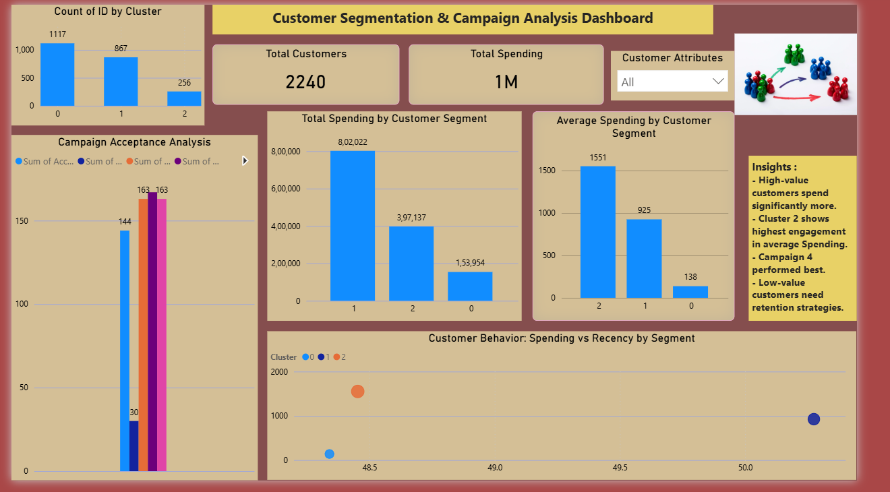

# Customer Segmentation & Campaign Analysis

---

## Project Overview

Segmented **2,240 customers** into **3 behavioral clusters** using K-Means clustering based on demographics, spending patterns, and campaign response to enable targeted marketing.

- Total customer spending analyzed: **1M+**
- Highest spending cluster: **Cluster 2** (avg spend: 1,551)
- Top performing campaign: **Campaign 4** (167 acceptances)
- Campaigns analyzed: **5 marketing campaigns**

---

## Tools and Technologies

| Tool | Purpose |
|------|---------|
| Python (Pandas, NumPy, Scikit-learn, Matplotlib, Seaborn) | Data cleaning, EDA, K-Means clustering |
| SQL (SQL Server) | Campaign analysis and aggregations |
| Power BI | Interactive dashboard and visualization |

---

## Folder Structure

- Data — Raw and Processed datasets
- Python — Jupyter notebook for cleaning, EDA, and clustering
- SQL — SQL queries for campaign analysis
- PowerBI — Power BI dashboard file

---

## Key Steps

**1. Data Cleaning and Preprocessing (Python)**
- Handled missing income values using median imputation
- Created new features — Total Spending, Age, Total Accepted Campaigns, Total Children
- Capped outliers to reduce skewness

**2. Customer Segmentation (Python)**
- Applied K-Means clustering to group 2,240 customers into 3 segments
- Identified Cluster 2 as highest value segment with 1,551 average spend
- Analyzed cluster characteristics by demographics and behavior

**3. Campaign Analysis (SQL)**
- Calculated total and average spending by cluster
- Analyzed acceptance rates across 5 marketing campaigns
- Identified Campaign 4 as top performer with 167 acceptances

**4. Dashboard Visualization (Power BI)**
- KPI cards showing total customers and total spending
- Clustered column charts for segment distribution and spending
- Scatter plot for spending vs recency by segment
- Slicers for interactive filtering by cluster and campaign

---

## Dashboard Preview

---

## Key Insights

- Cluster 2 customers contribute highest revenue despite smaller size
- Campaign 4 achieved highest acceptance rate (167) across all segments
- Customers with lower recency tend to spend significantly more
- Targeted campaigns for low spending clusters can improve overall revenue

---

## Business Impact

- Helps businesses focus marketing budget on high value customers
- Identifies underperforming segments with growth potential
- Enables data driven campaign targeting to improve acceptance rates
- Supports customer retention strategy through behavioral understanding

---

## Author

**Lakshmi Bhavani Reddy**

